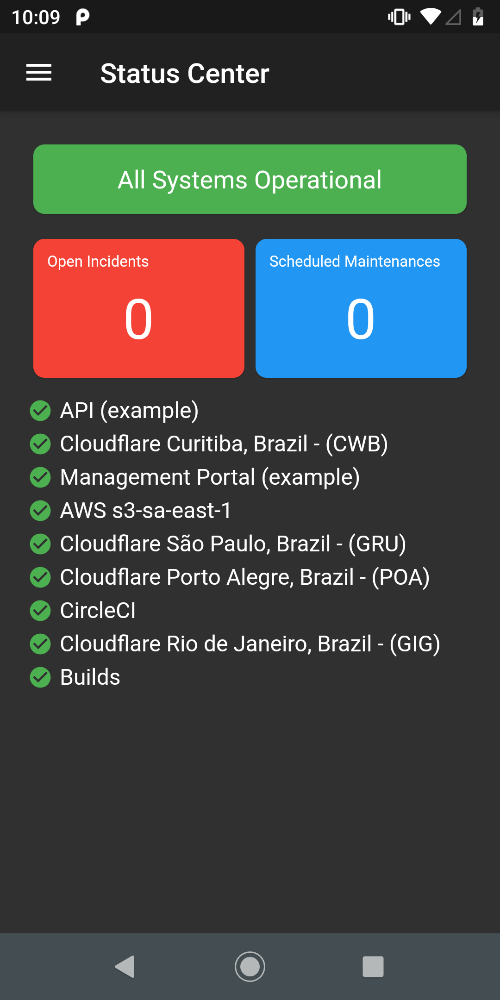
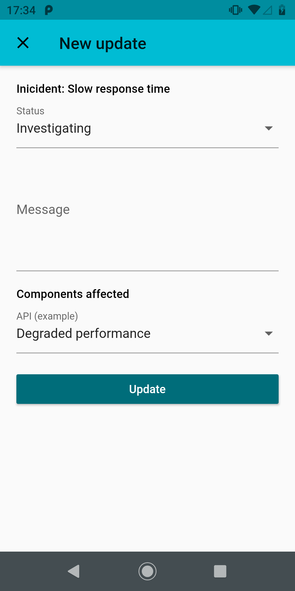
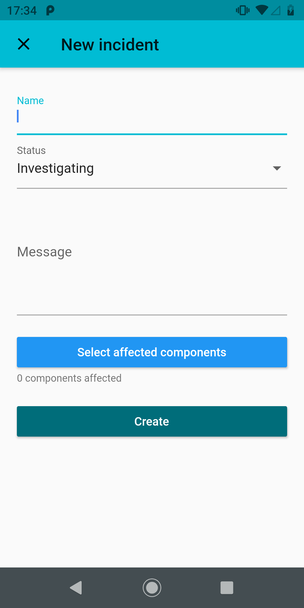

<h1 align="center">
  
   
  Status Center
</h1>

  An app where you can manage your <strong>statuspage.io page</strong> with ease and on the go.

 

_To support the project, the app has a small price_

## Features
- Dashboard with overview of current page status
- List all incidents (open, resolved and maintenances)
- Create new updates on open incidents
- Create new incident
- Schedule new maintenance
- Automatic dark mode
- No tracking or ads

More to come...

See the [project](https://github.com/valtlfelipe/statuscenter/projects/1) to know what's on the roadmap. Also, feel free to suggest any idea by oppening an issue.

## Screenshots

  
  
  
  
  
  
  
  

## Motivation
Currently as a single person that manages the status page (statuspage.io) on my company, I had, sometimes, the necessity to update the page on the go, without getting on my computer, or to follow long steps to just post an update (open the mobile browser, search for the site, log in, etc). So I thinked, why not create an app to help me with that (and maybe others that have the same "issue") and take this opportunity to learn something new.

Currently the app has a small price to help me pay the apple developer license so I can publish for iOS too and support the project.

More about my first app on my blog: https://felipe.im/posts/creating-my-first-mobile-app/.

## Support me
If you liked this app, please support my work (and help me paying the apple developer license) by buying the app or donating a cup of coffee, or supporting me on a monthly basis to help me reach some goals.

Thanks in advance ❤️

## Contributing
Feel free to report bugs or open pull requests to help improve **Status Center**.

The app is created entirely in Dart using Flutter. Here is how you can get started:

- Fork and clone this repo.
- Follow https://flutter.dev/docs/get-started/install on how to install flutter.
- Run `flutter pub get` to install dependencies inside the project folder.
- Have a simulator already running (iOS or Android).
- Run `flutter run` to run the app inside the simulator.

Flutter docs with more info: https://flutter.dev/docs.

<i>Disclaimer: Not affiliated with Atlassian Statuspage.</i>

<i>Google Play and the Google Play logo are trademarks of Google LLC.</i>

